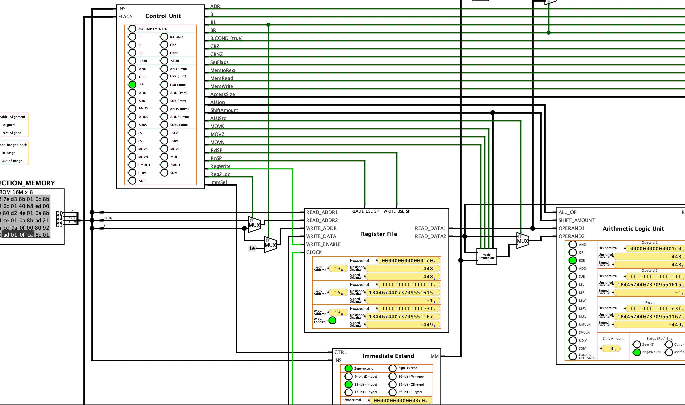

# Computer Organization with Logisim
Logisim designs for teaching computer organization.

&copy; 2021 Mehmet Kayaalp.

Cite as:
> Mehmet Kayaalp. 2021.
Using Logisim-evolution for Teaching Datapath and Control.
In Proceedings of WCAE ’21:
Workshop on Computer Architecture Education (WCAE ’21).
ACM, New York, NY, USA, 8 pages.

See [mkayaalp.net/computer-organization-logisim](https://mkayaalp.net/computer-organization-logisim) for details.

The circuit files in this repository:

- Logic design review examples
  - Combinational circuit example (full adder): [`full_adder.circ`](full_adder.circ)
  - Sequential circuit example: [`sequential.circ`](sequential.circ)
  - Synchronous circuit example (four-bit T flip-flop counter: [`sync.circ`](sync.circ)
  - Propagation delay example (five-bit D flip-flop counter: [`propagation.circ`](propagation.circ)
  - Tristate buffer and multiplexer example: [`tristate_mux.circ`](tristate_mux.circ)
  - 4-to-1 multiplexer: [`mux4.circ`](mux4.circ)
- Combinational vs. pipelined multiplier
  - Combinational 3-bit multiplier: [`combinational_multiplier.circ`](combinational_multiplier.circ)
  - Pipelined 3-bit multiplier: [`pipelined_multiplier.circ`](pipelined_multiplier.circ)
- Incrementally building a *Stored Program* computer
  - 3-bit accumulator machine: [`acc3.circ`](acc3.circ)
  - 4-bit accumulator machine: [`acc4.circ`](acc4.circ)
  - Simplified 4-bit accumulator machine: [`acc4_simplified.circ`](acc4_simplified.circ)
  - 4-bit accumulator machine with 4 registers: [`acc4_4regs.circ`](acc4_4regs.circ)
  - 4-bit register (3-operand) machine with 4 registers: [`reg4_4regs.circ`](reg4_4regs.circ)
  - Added an instruction register: [`ins_register.circ`](ins_register.circ)
  - Added an instruction memory: [`ins_memory.circ`](ins_memory.circ)
  - Added a branch instruction: [`branch.circ`](branch.circ)
  - Added a conditional branch instruction: [`conditional_branch.circ`](conditional_branch.circ)
  - Added a load (from data memory) instruction: [`load_data_memory.circ`](load_data_memory.circ)
  - Added a store (into data memory) instruction: [`store_data_memory.circ`](store_data_memory.circ)
- Converting the design into ARMv8
  - Increase register width to 64-bits: [`1_use64bitregs.circ`](1_use64bitregs.circ)
  - Increase the number of registers to 8: [`2_use8regs.circ`](2_use8regs.circ)
  - Increase the number of registers to 16: [`3_use16regs.circ`](3_use16regs.circ)
  - Increase the number of registers to 32: [`4_use32regs.circ`](4_use32regs.circ)
  - Put registers into a Register File subcircuit: [`5_useregfile.circ`](5_useregfile.circ)
  - Increase instruction size to 32-bits: [`6_use32bitinstructions.circ`](6_use32bitinstructions.circ)
  - Use byte-addressed instruction memory: [`7_usebyteaddressedinsmem.circ`](7_usebyteaddressedinsmem.circ)
  - Use the ARMv8 instruction encoding format: [`8_usearmv8instructionformat.circ`](8_usearmv8instructionformat.circ)
  - Add the `sub` (register) instruction: [`9_implement_sub.circ`](9_implement_sub.circ)
  - Add the `sub` (immediate) instruction: [`10_implement_sub_imm.circ`](10_implement_sub_imm.circ)
  - Fix the offset for `ldur` and `stur`: [`11_fixldursturoffset.circ`](11_fixldursturoffset.circ)
- Physical lab
  - LED Blink circuit: [`led_blink.circ`](led_blink.circ)
    - Improved ARMv8 datapath with subcircuits
    - Added LED outputs and subcircuit layouts for easy debugging
    - Added instructions: `bl`, `cbnz`, `ldur` (word), `stur` (word), `lsl`, `lsr`
    - Added PC resetting to `0080_0000` (the program starting address for Raspberry Pi 3)
    - Added a memory controller with peripheral addresses starting at `3F00_0000` (matching Raspberry Pi 3)
    - Added a GPIO peripheral at address `3F20_0000` (matching BCM2837 of Raspberry Pi 3)
    - Added BCM2837 GPIO registers: `GPFSELn`, `GPSETn`, `GPCLRn`
  - Datapath improvements: [`added_sp_br_flags_adds_subs_ands_bcond.circ`](added_sp_br_flags_adds_subs_ands_bcond.circ)
    - Added proper handling of `SP` register
    - Added flags register used in conditional branching
    - Added flag-setting variants: `adds`, `subs`, `ands`
    - Added indirect branch instruction: `br`
    - Added flag-based conditional branch instructions: `b.cond`
  - More instructions: [`added_imms_mul_div_accesssize_varshift.circ`](added_imms_mul_div_accesssize_varshift.circ)
    - Added logical immediate encoding
    - Added wide-immediate instructions: `movz`, `movk`, `movn`
    - Added variable logical shift: `lslv`, `lsrv`
    - Added multiplication and division: `mul`, `umulh`, `smulh`, `udiv`, `sdiv`
    - Added half-word- and byte-sized memory access: `ldurh`, `sturh`, `ldurb`, `sturb`
  - LCD display: [`added_lcd_display.circ`](added_lcd_display.circ)
    - Added PC-relative address instruction: `adr`
    - Added an I2C peripheral (send-only) at address `3F80_4000` (matching BSC1 of BCM2837 of Raspberry Pi 3)
    - Added BCM2837 BSC registers: `C`, `S`, `DLEN`, `ADDR`, `FIFO_DATA`
    - Added an I2C device (receive-only) (matching the PCF8574 on the LCD backpack)
    - Added an HD44780 module with a character matrix LCD display
- Pipelined LEGv8 datapath with forwarding unit (no hazard detection or stalling): [`pipeline.circ`](pipeline.circ)
