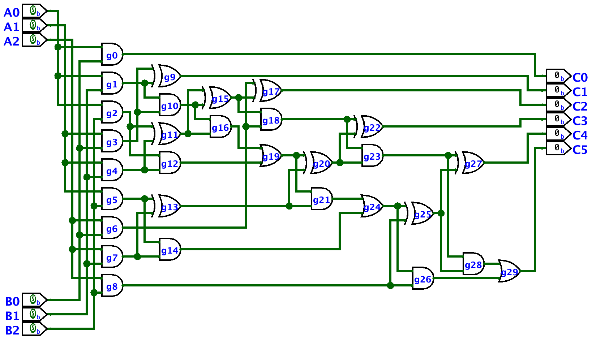
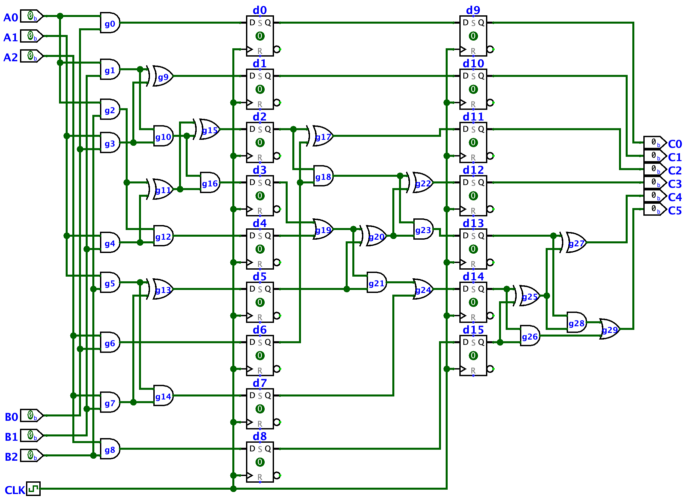

After some propagation delay and critical path examples, 
a three-bit combinational multiplier is a good example to 
test the circuit analysis skills.
It is not trivial circuit,
but it is not very complex either.

You can find it in the `combinational_multiplier.circ` file.

Assuming each gate has a certain latency, say 10ns,
- What is the latency of the critical path?
- Which gates are on the/a critical path?
- If A0 is 0 and is ready at t=0,
when would output C0 be ready as 0?
- If all inputs arrive at t=0,
when would the output C1 be ready?
- If A2 is 0 and is ready at t=0,
when would output C5 be ready as 0?

The same circuit is implemented as
a sequential (synchronous) circuit as shown below.
This design is said to be **pipelined**.

You can find this circuit in the `pipelined_multiplier.circ` file.

Assuming the same gate delay of 10ns, a setup time requirement
of 3ns, and no clock-to-Q delay:
- What is the minimum clock period?
- What is the maximum clock frequency?
