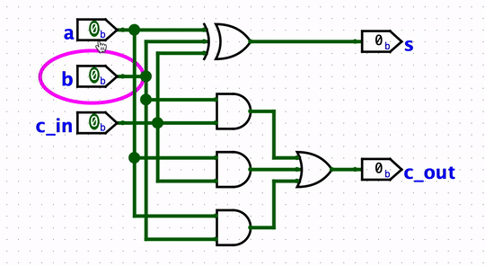

A combinational circuit has inputs, gates and outputs.

The logic shown below is called a **full adder**,
where the `s` output is the sum of inputs `a`, `b`, and `c_in` (carry in), and `c_out` output is the carry out.

Note that for a given combinational circuit,
each output is some function of the inputs, and nothing else.
Not of time, and not of its previous inputs.
Appling a particular input combination gives the same output every time.

You can open the `full_adder.circ` file in Logisim and verify this by toggling the inputs.

Visually, when the inputs are on the left side and the outputs on the right side,
a combinational circuit can be constructed without any of its wires going from right to left.
The signals would flow in the left-right direction without any loops.
