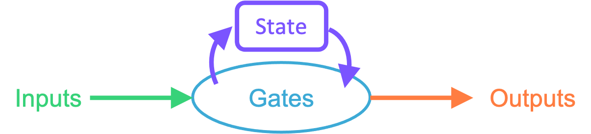
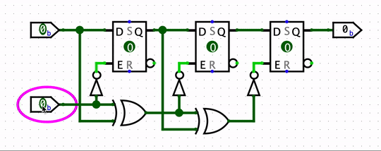
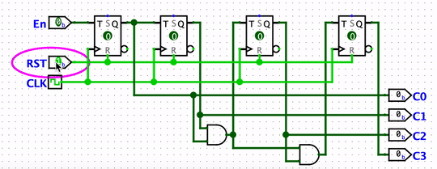
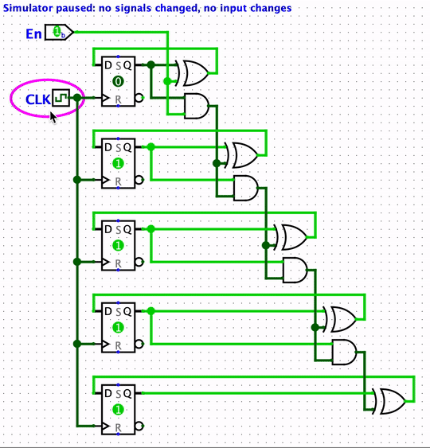
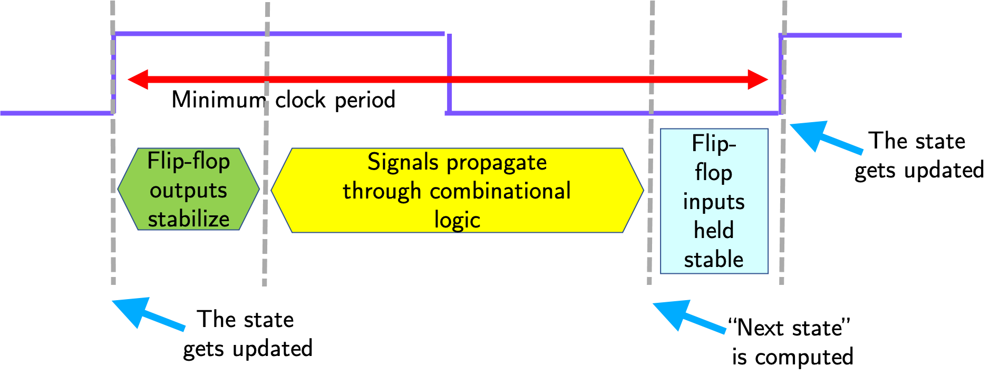

A digital logic design course covers the topics of
[combinational](#combinational-logic) and
[sequential](#sequential-logic) digital circuits.
For studying computer organization,
we are particularly interested in
[synchronous](#synchronous-logic) sequential circuits,
which make it easy for us to analyze the
[propagation delay](#propagation-delay).

We can review the distinction of these circuit types
by showing simple Logisim examples.

## Combinational Logic

A combinational circuit has inputs, gates and outputs.

The logic shown below is called a **full adder**,
where the `s` output is the sum of inputs `a`, `b`, and `c_in` (carry in), and `c_out` output is the carry out.

Note that for a given combinational circuit,
each output is some function of the inputs, and nothing else.
Not of time, and not of its previous inputs.
Appling a particular input combination gives the same output every time.

You can open the `full_adder.circ` file in Logisim and verify this by toggling the inputs.

Visually, when the inputs are on the left side and the outputs on the right side,
a combinational circuit can be constructed without any of its wires going from right to left.
The signals would flow in the left-right direction without any loops.

## Sequential Logic

A sequential circuit has the key addition of **state**, or **memory**:
elements that remember the past.

The circuit below detects a particular sequence of input values.
Note that when top input is `1` and bottom input is `0`,
the output can be `0` or `1` depending on the current state (values in D flip-flops).

In fact, the output is set to `1`,
if the top input stays at `1`
while the bottom input goes from `0` to `1`,
then to `0` again.

You can open the `sequential.circ` file in Logisim to examine this circuit.

## Synchronous Logic

In a combinational circuit, the outputs are not instantenously updated
to their correct values when an input changes (or when the circuit is powered on),
since each gate and interconnect has a propagation delay.

For a combinational circuit,
this means we have to wait for a certain amount of
time after changing the inputs, before considering the outputs to be valid.

For sequential circuits, however,
the propagation delay represents a challenge.
The outputs are not only a function of the inputs,
but also of the previous inputs.
We need to pay attention to the order of events,
to ensure state elements and outputs are properly updated.
Often, we want simultaneous updates to distinct state elements:
e.g. a two-bit counter incremented from `01` to `10` without being
interpreted as `00` or `11` in the process,
just because one of the bits happens to be flipped slightly before the other.

The synchronous logic is a solution to this problem,
in which every state update is controlled by
a single synchronizing **clock signal**,
which is usually a periodic square wave
alternating between `0` and `1` with a certain frequency,
i.e. the clock rate.

The logic shown below is a four-bit counter,
implemented using T flip-flops.

The counter value is cleared when `RST` (reset) is `1`.
If `En` is `1` (enabled), it will count up every time
the `CLK` (clock) signal switches from `0` to `1`.
This transition is called the "positive edge"
or the "rising edge" of the clock.
The small triangle in the T flip-flops indicate
that updates are "triggered" by this rising edge.

Note that all the state is connected to one single
clock signal for synchronization.
This makes it easier to design and study circuits.

You can open the `sync.circ` file in Logisim to examine this circuit.

## Propagation Delay

Logisim does not properly model propagation delays,
but it simulates the operation of circuits in iterations,
We can visualize these iterations
using the `Simulate -> Single-Step Propagation` menu option,
and see the order of events
as changes propagate through gates and interconnects.

The five-bit counter below is similar to the previous circuit,
except this one is implemented with D flip-flops.

Starting with the counter value `11110`
(read the flip-flops bottom to top),
the rising clock edge causes
flip-flop contents to be simultaneously
updated---only the topmost flip-flop changes in this case.
After a certain delay (called **CLK-to-Q** delay),
the updated values appear on the Q output of the flip-flops,
representing the counter value `11111`.
Sent through the combinational gates,
these bits are used to determine the next value of the counter,
which is `00000`.
At the next rising clock edge,
all flip-flops will be changed to `0`.

You can find this circuit in the Logisim file called `propagation.circ`.

As can be seen in the example,
the input to the bottom flip-flop is the latest
to be calculated,
as the signal passes through four `AND` gates,
and one `XOR` gate.
This path has the largest propagation delay,
i.e. this is the **critical path**.

Only after every flip-flop input is valid and ready,
we can start the next update to flip-flop contents.
For correct operation,
the next rising clock edge should not happen before
the signals are propagated, stabilized,
**AND** are held stable for a period of
time---called **setup time**---required
for updating the flip-flops.

These requirements are the determining factors
for the minimum amount of time between successive
rising clock edges, i.e. the **minimum clock period**:

Since the clock rate, or clock frequency,
is the inverse of the clock period,
this also determines the **maximum clock frequency**.
