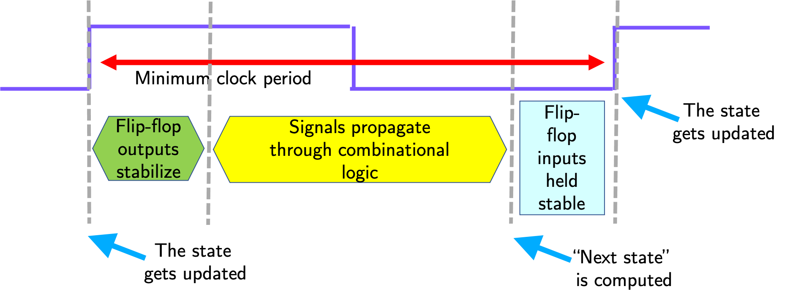

## Propagation Delay

Logisim does not properly model propagation delays,
but it simulates the operation of circuits in iterations,
We can visualize these iterations
using the `Simulate -> Single-Step Propagation` menu option,
and see the order of events
as changes propagate through gates and interconnects.

The five-bit counter below is similar to the previous circuit,
except this one is implemented with D flip-flops.

Starting with the counter value `11110`
(read the flip-flops bottom to top),
the rising clock edge causes
flip-flop contents to be simultaneously
updated---only the topmost flip-flop changes in this case.
After a certain delay (called **CLK-to-Q** delay),
the updated values appear on the Q output of the flip-flops,
representing the counter value `11111`.
Sent through the combinational gates,
these bits are used to determine the next value of the counter,
which is `00000`.
At the next rising clock edge,
all flip-flops will be changed to `0`.

You can find this circuit in the Logisim file called `propagation.circ`.

## Clock Period

As can be seen in the above example,
the input to the bottom flip-flop is the latest
to be calculated,
as the signal passes through four `AND` gates,
and one `XOR` gate.
This path has the largest propagation delay,
i.e. this is the **critical path**.

Only after every flip-flop input is valid and ready,
we can start the next update to flip-flop contents.
For correct operation,
the next rising clock edge should not happen before
the signals are propagated, stabilized,
**AND** are held stable for a period of
time---called **setup time**---required
for updating the flip-flops.

These requirements are the determining factors
for the minimum amount of time between successive
rising clock edges, i.e. the **minimum clock period**:

Since the clock rate, or clock frequency,
is the inverse of the clock period,
this also determines the **maximum clock frequency**.
