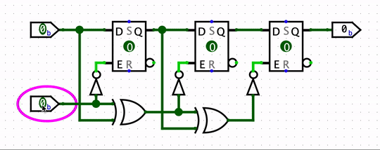

A sequential circuit has the key addition of **state**, or **memory**:
elements that remember the past.

The circuit below detects a particular sequence of input values.
Note that when top input is `1` and bottom input is `0`,
the output can be `0` or `1` depending on the current state (values in D flip-flops).

In fact, the output is set to `1`,
if the top input stays at `1`
while the bottom input goes from `0` to `1`,
then to `0` again.

You can open the `sequential.circ` file in Logisim to examine this circuit.
