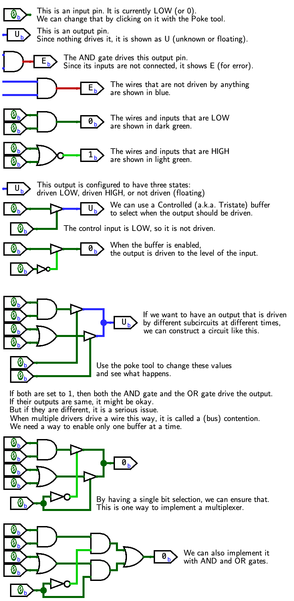
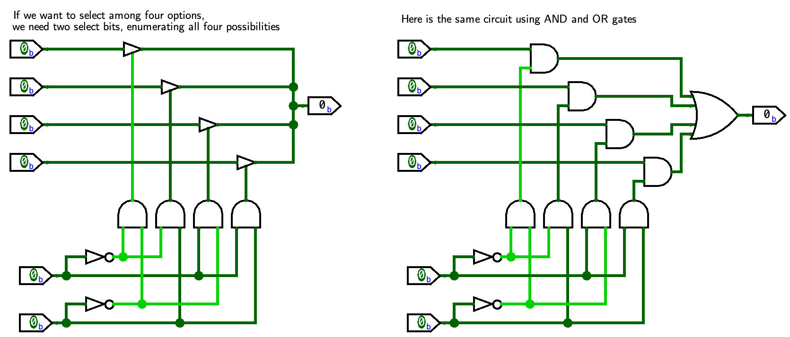

By adding text inside Logisim,
we can create circuit files that walk the user through
different examples.

The figure below shows the `tristate_mux.circ` file that
presents the topics of tristate buffers,
"floating" values (the wire is not driven),
"error" values (the wire is being driven to opposite values),
and implementing multiplexers
with tristate buffers or combinational gates.

The circuit file `mux4.circ` shows the difference
for a multiplexer selecting from four inputs (4-to-1 multiplexer):

